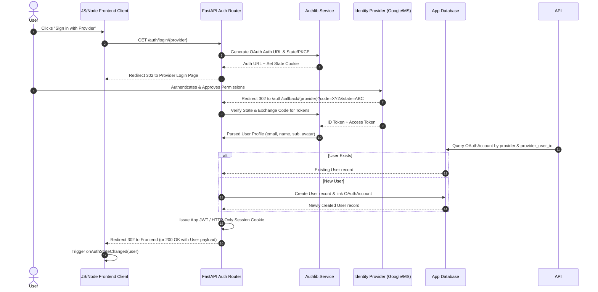

# Requirement Specification: Standalone OAuth2 / OIDC Authentication Component

**Feature Title:** Modular Standalone OAuth2 / OIDC Authentication Component  
**Document Status:** Draft / Ready for Review  
**Version:** 1.0  
**Target Applications:** AI Stream Radio & Future Web Projects  
**Tech Stack:** FastAPI + Authlib (Backend), JavaScript / Node.js (Frontend Client SDK)  
**Primary Reference:** [`documentation/Authentication_Recommendation..md`](file:///Users/charliemarciano/workspace/projects/aistreamradio/documentation/Authentication_Recommendation..md)

---

## 1. Executive Summary & Purpose

Modern web applications require robust user identity verification without relying on expensive, proprietary third-party hosted auth vendors (e.g. Auth0, Clerk, Firebase Auth). 

This requirement document specifies a **standalone, modular authentication component** designed for maximum portability and zero vendor lock-in. The component provides social sign-in (OAuth 2.0 / OpenID Connect) and session management.

### Key Goals:
1. **High Reusability & Modular Decoupling**: The backend logic and frontend client SDK must be completely decoupled from application-specific code (`aistreamradio`), enabling simple copy-paste or package installation into any future Python/FastAPI backend and JavaScript/Node.js frontend project.
2. **Cost-Free & Self-Hosted**: Built using **FastAPI** and **Authlib** on the backend to avoid subscriptions and retain full ownership over user data and database records.
3. **Flexible Frontend**: Built as a zero-dependency **JavaScript / Node.js client SDK** compatible with Vanilla JS, React, Vue, Next.js, or Express/Node.js middle-tiers.

---

## 2. Component Architecture & Reusability Strategy

To ensure seamless reuse across multiple independent projects, the authentication system is structured as two isolated, self-contained sub-components:

```
                  ┌──────────────────────────────────────────────────┐
                  │            FRONTEND COMPONENT                    │
                  │   JavaScript / Node.js Client SDK & UI Widget   │
                  └─────────────────────────┬────────────────────────┘
                                            │ HTTP / JSON API
                                            ▼
                  ┌──────────────────────────────────────────────────┐
                  │             BACKEND COMPONENT                    │
                  │   FastAPI Router + Authlib Service Module        │
                  └─────────────────────────┬────────────────────────┘
                                            │
                      ┌─────────────────────┴─────────────────────┐
                      ▼                                           ▼
          ┌──────────────────────┐                    ┌──────────────────────┐
          │  External OAuth IDP  │                    │ Local Database (ORM) │
          │ (Google, MS, FB, etc)│                    │ (User & Account Map) │
          └──────────────────────┘                    └──────────────────────┘
```

### Modular Packaging Requirements:
- **Backend Component (`auth_service`)**:
  - Encapsulated inside a reusable Python package / module structure (e.g., `app/routers/auth.py` and `app/services/auth_service.py`).
  - Accepts external configuration via standard environment variables (OAuth Client IDs, Secrets, Redirect URIs, JWT Secret).
  - Uses generic database abstractions/interfaces so local `User` and `OAuthAccount` models can be adapted to any database setup (SQLAlchemy, SQLModel, Tortoise, etc.).
- **Frontend Component (`auth-client.js`)**:
  - Implemented as a clean JavaScript / Node.js module (ES Modules / CommonJS / UMD).
  - Provides a simple programmatic API (`login()`, `logout()`, `getUser()`, `onAuthStateChanged()`).
  - Operates independently of any framework (React/Vue wrapper layers can be thin extensions over this base JS client).

---

## 3. Sequence Diagram & Authentication Flow

The following diagram illustrates the OAuth 2.0 Authorization Code flow with State/PKCE validation handled by the modular auth component:



---

## 4. Functional Requirements

### FR-1: Social OAuth 2.0 / OIDC Identity Providers
- **FR-1.1**: Primary support for **Google Sign-In** (OpenID Connect).
- **FR-1.2**: Plug-and-play extensible support for **Microsoft**, **Facebook**, and **LinkedIn** via simple provider configuration flags in Authlib.
- **FR-1.3**: Automatic profile normalization across providers (standardizing `email`, `first_name`, `last_name`, `avatar_url`, and provider `sub`/ID).

### FR-2: Backend Auth Engine (FastAPI + Authlib)
- **FR-2.1**: Provider registration via Authlib's `OAuth` registry initialized dynamically from environment variables.
- **FR-2.2**: Authorization Code exchange with robust `state` parameter validation to prevent Cross-Site Request Forgery (CSRF).
- **FR-2.3**: Identity token signature verification and claim validation (audience, issuer, expiration).

### FR-3: User Provisioning & Identity Linking
- **FR-3.1**: **Local User Mapping**: Every social identity must map to a internal `User` record in the database. Raw social access tokens must never be used directly as the app session token.
- **FR-3.2**: **Account Linking**: If an authenticated user logs in with a different provider sharing the same verified email, the system should allow linking multiple `OAuthAccount` providers to a single `User` record.

### FR-4: Session & Token Management
- **FR-4.1**: **Session Storage**: Supports dual-mode session management:
  - **Mode A (Recommended)**: Secure `HttpOnly`, `SameSite=Lax/Strict`, `Secure` HTTP session cookies.
  - **Mode B**: Bearer JWT tokens returned in JSON responses for cross-domain / mobile app client usage.
- **FR-4.2**: **JWT Claims**: Standardized payload containing `sub` (User ID), `email`, `iat`, `exp`, and `iss`.
- **FR-4.3**: **Token Expiration & Renewal**: Configurable access token lifetime (default 24h) with optional refresh token flow.

### FR-5: Standalone JavaScript / Node.js Frontend Client
- **FR-5.1**: Zero external runtime dependencies for maximum lightweight integration.
- **FR-5.2**: Client SDK must expose the following core API methods:
  - `init(config)`: Configure backend base URL and auth mode (cookie vs token).
  - `login(provider, redirectUrl)`: Trigger provider auth redirect.
  - `logout()`: Invalidate session locally and call backend logout endpoint.
  - `getUser()`: Fetch current authenticated user state.
  - `onAuthStateChanged(callback)`: Event listener fired on login, logout, or session expiry.
- **FR-5.3**: Node.js server-side support (e.g. for SSR / Next.js API routes or Express middleware to check user session headers).

### FR-6: Protected Route Dependency / Middleware
- **FR-6.1**: Provide a clean FastAPI dependency (`get_current_user` / `get_optional_user`) for easy route protection.
- **FR-6.2**: Returns `401 Unauthorized` with appropriate error details when credentials are missing or invalid.

---

## 5. Non-Functional Requirements (NFRs)

### NFR-1: Reusability & Zero Application Coupling
- The authentication component MUST NOT import any business logic or application-specific database models from `aistreamradio`.
- Reusing this component in a new project should only require copying the `auth` module folder and specifying environment variables.

### NFR-2: Security Compliance
- All authorization flows MUST use TLS (`https://` in production).
- Session cookies MUST carry `HttpOnly`, `Secure`, and `SameSite` flags.
- OAuth `state` values MUST be cryptographically random and stored in short-lived encrypted cookies or redis cache during the handshake.

### NFR-3: Database Agnosticism & Extensibility
- Data access MUST be decoupled using generic repository patterns or flexible SQLAlchemy abstract base models, allowing target projects to use SQLite, PostgreSQL, or MySQL seamlessly.

---

## 6. Proposed Database Schema

The component requires two core tables:

### `users` Table
| Column | Type | Constraints | Description |
| :--- | :--- | :--- | :--- |
| `id` | String / UUID | PRIMARY KEY | Unique user identifier |
| `email` | String | UNIQUE, NOT NULL | Primary email address |
| `full_name` | String | NULLABLE | User display name |
| `avatar_url` | String | NULLABLE | Profile picture URL |
| `is_active` | Boolean | DEFAULT True | Account status flag |
| `created_at` | DateTime | NOT NULL | Timestamp of creation |
| `updated_at` | DateTime | NOT NULL | Timestamp of last update |

### `oauth_accounts` Table
| Column | Type | Constraints | Description |
| :--- | :--- | :--- | :--- |
| `id` | String / UUID | PRIMARY KEY | Unique account mapping ID |
| `user_id` | String / UUID | FOREIGN KEY (`users.id`) | Linked local user ID |
| `provider` | String | NOT NULL | IDP name (e.g., `google`, `microsoft`) |
| `provider_user_id` | String | NOT NULL | IDP unique subject identifier |
| `created_at` | DateTime | NOT NULL | Timestamp of connection |

---

## 7. API Specification (FastAPI Auth Component)

| Endpoint | Method | Description | Response |
| :--- | :--- | :--- | :--- |
| `/auth/providers` | `GET` | List enabled OAuth providers | `{"providers": ["google", "microsoft"]}` |
| `/auth/login/{provider}` | `GET` | Initiates OAuth flow for specified provider | `302 Redirect` to Provider Login URL |
| `/auth/callback/{provider}` | `GET` | Provider redirect destination post-login | `302 Redirect` to Frontend with Session Cookie |
| `/auth/me` | `GET` | Retrieve current authenticated user profile | `200 OK` (User object) or `401 Unauthorized` |
| `/auth/logout` | `POST` | Invalidates session and clears cookies | `200 OK {"message": "Logged out"}` |
| `/auth/refresh` | `POST` | Refreshes session token if expired | `200 OK` (New token / refreshed cookie) |

---

## 8. Frontend Component Integration Example (JavaScript / Node.js)

Below is an example illustrating how the standalone JavaScript client SDK will be instantiated and used in any future web project:

```javascript
// Example: Importing and using the standalone auth client SDK
import { AuthClient } from './auth-client.js';

const auth = new AuthClient({
    baseUrl: 'http://localhost:8000/api/v1',
    mode: 'cookie' // 'cookie' or 'token'
});

// Subscribe to auth state updates
auth.onAuthStateChanged((user) => {
    if (user) {
        console.log('User signed in:', user.full_name, user.email);
        document.getElementById('user-profile').innerText = `Hello, ${user.full_name}`;
    } else {
        console.log('User signed out');
    }
});

// Trigger Google Sign-In
document.getElementById('login-google-btn').addEventListener('click', () => {
    auth.login('google');
});

// Trigger Logout
document.getElementById('logout-btn').addEventListener('click', () => {
    auth.logout();
});
```

---

## 9. Next Steps & Implementation Roadmap

1. **Phase 1**: Scaffold reusable Python backend module in `app/services/auth/` and router in `app/routers/auth.py`.
2. **Phase 2**: Define generic SQLAlchemy ORM models (`User` and `OAuthAccount`).
3. **Phase 3**: Implement Authlib OAuth registry with Google provider credentials in `.env`.
4. **Phase 4**: Develop lightweight vanilla JS / Node.js standalone SDK `auth-client.js`.
5. **Phase 5**: Integration testing in `aistreamradio` and documentation of migration steps for external projects.
