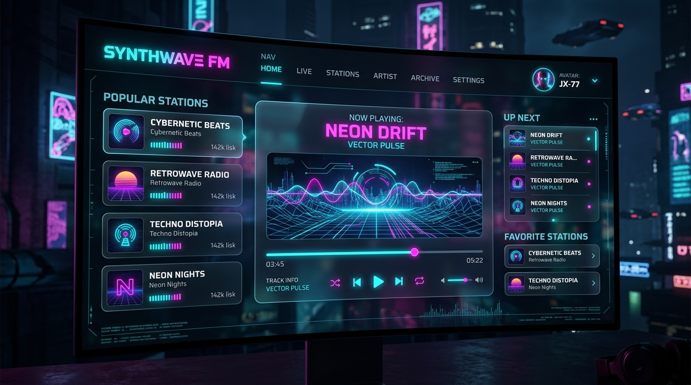

# Futuristic Dark Theme Refactor

We have transformed the Radio Station application's look and feel into a premium, responsive **Cyberpunk / Synthwave** dark interface.

## Key Enhancements

### 🎨 Visual & Aesthetic System
* **Deep Space Color Palette:** We replaced the plain light-purple background and solid gray panels with deep obsidian backgrounds (`#06070d` to `#0b0e17`) and semi-transparent glassmorphic cards (`rgba(16, 20, 35, 0.65)` with `backdrop-filter: blur(12px)`).
* **Cybernetic Accents:** Integrated glowing neon cyan (`#00f3ff`) and cyberpunk magenta (`#ff007f`) outlines, text-shadows, and input states.
* **Modern Typography:** Loaded high-tech sans-serif fonts **Orbitron** (for titles, timer readouts, badges, and station labels) and **Rajdhani** (for metadata titles and buttons).
* **Grid Background:** Added a subtle glowing neon coordinate grid overlay in the background (`linear-gradient(rgba(0,243,255,0.02) 1px, transparent 1px)`).

### ⚡ Interaction & Animation
* **Active Playback Pulse Glow:** Updated [player.js](file:///Users/charliemarciano/workspace/projects/radiostation/app/static/player.js) to toggle a `.playing` class on the album art. When playing, the cover art slowly pulses with dynamic cyan and magenta neon drop-shadows.
* **Cyberpunk Rating Controls:** Liking/disliking now lights up corresponding buttons with vivid neon emerald (thumbs up) and neon ruby (thumbs down) glows.
* **Micro-interactive Elements:** Added hover lifts, glowing slider handles, and fluid state changes to the player dashboard and paginated disliked panels.

---

## 🖥 Design Style Preview

Below is a visual preview of the cyberpunk-inspired design aesthetic applied to the application:

