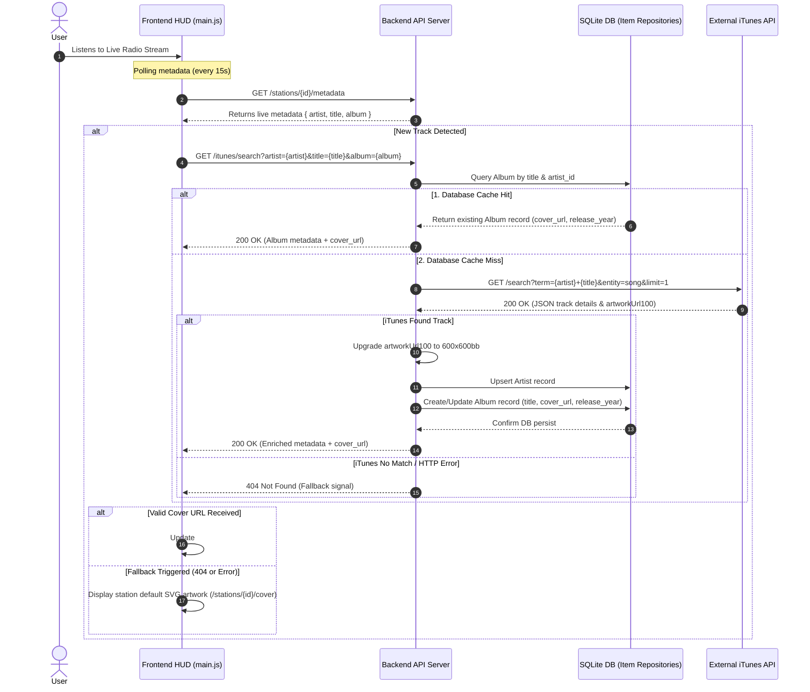

# Requirement Specification: Track Metadata & Album Cover Art Auto-Lookup

**Feature Title:** Dynamic Album Metadata & Cover Art Auto-Lookup  
**Document Status:** Approved / Ready for Implementation  
**Version:** 1.0  
**Target Application:** AI Stream Radio  
**Related Components:** Frontend HUD ([`main.js`](file:///Users/charliemarciano/workspace/projects/aistreamradio/app/static/Script/main.js)), Backend iTunes Service ([`app/services/itunes.py`](file:///Users/charliemarciano/workspace/projects/aistreamradio/app/services/itunes.py)), Item/Album Repositories ([`app/repositories/albums.py`](file:///Users/charliemarciano/workspace/projects/aistreamradio/app/repositories/albums.py)), Database Models ([`app/models.py`](file:///Users/charliemarciano/workspace/projects/aistreamradio/app/models.py))

---

## 1. Executive Summary & Purpose

When live streaming radio, incoming ICY metadata often provides only basic track information (e.g., song title and artist name), frequently omitting official album artwork, release year, or album titles. 

This requirement document defines the specification for an automated **Metadata & Cover Art Lookup Service**. When a new song starts playing on the live stream and valid metadata (artist, track title, optional album) is detected:
1. The system checks the local database ("item servers") to determine if album information and artwork already exist.
2. If found locally (**Cache Hit**), the metadata and artwork are instantly retrieved from the database and displayed on the web interface.
3. If not found locally (**Cache Miss**), the backend queries the external **iTunes Search API**, extracts high-resolution artwork and album metadata, persists the new `Artist` and `Album` records into the local database, and returns the artwork for display.

---

## 2. System Workflow & Sequence Diagram

The diagram below illustrates the end-to-end data flow when a track change occurs:



---

## 3. Functional Requirements

### FR-1: Track Change Detection & Triggering
- **FR-1.1:** The frontend client MUST monitor metadata polling responses from `/stations/{id}/metadata`.
- **FR-1.2:** When a metadata response contains valid `artist` and `title` strings that differ from the currently playing track (`currentTrackKey`), the client MUST initiate a cover art & album lookup request.

### FR-2: Local Database Cache Check ("Item Server First")
- **FR-2.1:** Upon receiving a lookup request with `artist`, `title`, and optional `album`, the backend MUST search the local database first before contacting external services.
- **FR-2.2:** The lookup MUST match `Artist` by name and `Album` by title (associated with `artist_id`).
- **FR-2.3:** If an `Album` record exists in the database with a non-null `cover_url`, the backend MUST immediately return this record without executing an external network call.

### FR-3: External iTunes API Fallback & Fetching
- **FR-3.1:** If no matching `Album` or `cover_url` is found in the local database, the backend MUST query the iTunes Search API (`https://itunes.apple.com/search`).
- **FR-3.2:** The search term MUST be constructed using non-empty, sanitized values: `"{artist} {title} {album}"`.
- **FR-3.3:** The iTunes request parameter MUST specify `entity=song` and `limit=1`.
- **FR-3.4:** High-resolution artwork MUST be derived by replacing `100x100bb` in `artworkUrl100` with `600x600bb`.

### FR-4: Database Persistence & Cache Update
- **FR-4.1:** When iTunes returns valid metadata:
  - If the `Artist` does not exist in the `artists` table, create a new `Artist` record.
  - If the `Album` does not exist in the `albums` table, create a new `Album` record linked to `artist_id` with `title`, `cover_url`, and `release_year`.
  - If the `Album` exists but lacks `cover_url` or `release_year`, update the record with the retrieved iTunes data.
- **FR-4.2:** Database updates MUST commit prior to returning the API response to ensure subsequent plays result in a **Cache Hit**.

### FR-5: Frontend Rendering & DOM Updating
- **FR-5.1:** Upon receiving enriched metadata and `cover_url`, the client MUST update:
  - Image element [`#coverArt`](file:///Users/charliemarciano/workspace/projects/aistreamradio/app/static/Script/main.js#L7) `src` attribute.
  - Text element [`#albumName`](file:///Users/charliemarciano/workspace/projects/aistreamradio/app/static/Script/main.js#L9) text content with the album title and release year (e.g., `"Cyberpunk Dreams (2024)"`).
- **FR-5.2:** Image loading errors (`onerror`) MUST be handled by gracefully falling back to station-branded artwork (`/stations/{id}/cover`) or default system cover art ([`default-cover.svg`](file:///Users/charliemarciano/workspace/projects/aistreamradio/app/static/Images/default-cover.svg)).

---

## 4. API Specification

### Endpoint: `GET /itunes/search` (or `/albums/lookup`)

**Query Parameters:**
| Parameter | Type | Required | Description | Example |
|---|---|---|---|---|
| `artist` | string | **Yes** | Artist name | `"Daft Punk"` |
| `title` | string | **Yes** | Song/Track title | `"One More Time"` |
| `album` | string | No | Optional album name | `"Discovery"` |
| `release_date`| string | No | Optional release date string | `"2001"` |

**Response Schema (`200 OK`):**
```json
{
  "artist_id": 42,
  "artist_name": "Daft Punk",
  "album_id": 108,
  "album_name": "Discovery",
  "cover_url": "https://is1-ssl.mzstatic.com/image/thumb/Music115/v4/.../600x600bb.jpg",
  "release_date": "2001-03-12T00:00:00Z",
  "release_year": 2001,
  "itunes_url": "https://music.apple.com/us/album/one-more-time/...",
  "genre": "Dance",
  "cached": true
}
```

**Response Schema (`404 Not Found`):**
```json
{
  "detail": "No information found on iTunes for the requested track"
}
```

---

## 5. Non-Functional Requirements

1. **Latency & Response Time:**
   - Database Cache Hit response time MUST be $< 50\text{ ms}$.
   - External iTunes lookup response time MUST be $< 1.5\text{ s}$.
2. **External HTTP Timeout:**
   - The iTunes HTTP request MUST enforce a maximum timeout of **5.0 seconds** to avoid blocking server resources.
3. **Resilience & Fault Tolerance:**
   - If iTunes is unreachable, times out, or returns HTTP errors (5xx/4xx), the application MUST log a warning and return a clean fallback response without throwing unhandled exceptions.
4. **CORS & Security:**
   - Artwork URLs served or proxied MUST be compatible with HTML `` elements to allow canvas snapshot capture during song ratings.

---

## 6. Acceptance Criteria (Gherkin Format)

### Scenario 1: Successful Album Lookup from Local Database (Cache Hit)
```gherkin
Given a song "Get Lucky" by "Daft Punk" starts playing on the station
And the album "Random Access Memories" with cover_url exists in the local database
When the client requests metadata lookup for "Daft Punk" - "Get Lucky"
Then the backend MUST retrieve the album record directly from the local database
And no HTTP request MUST be made to external iTunes servers
And the frontend MUST display the cover artwork and album title "Random Access Memories"
```

### Scenario 2: Cache Miss with Successful iTunes Retrieval & Persistence
```gherkin
Given a song "Blinding Lights" by "The Weeknd" starts playing
And the album "After Hours" DOES NOT exist in the local database
When the client requests metadata lookup for "The Weeknd" - "Blinding Lights"
Then the backend MUST query the external iTunes Search API
And upon receiving results, create an "Artist" record for "The Weeknd"
And create an "Album" record for "After Hours" with cover_url "https://.../600x600bb.jpg" in the database
And the frontend MUST update the cover art image to display the newly fetched artwork
```

### Scenario 3: Track Not Found on iTunes (Graceful Fallback)
```gherkin
Given an unknown indie track "Unreleased Demo 01" by "Unknown Underground Band" starts playing
When the client requests metadata lookup
And the local database contains no match
And the iTunes Search API returns 0 results
Then the backend MUST return a 404 response
And the frontend MUST retain or set the cover art image to the station's default artwork "/stations/{id}/cover"
And no error modal or broken image icon MUST be displayed to the user
```
